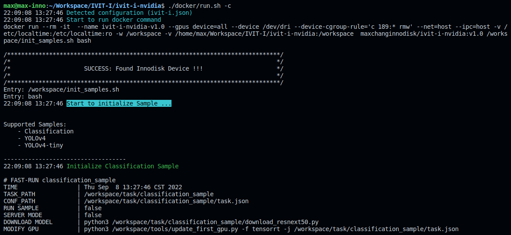

# iVIT-I For NVIDIA
iVIT-I for NVIDIA x86 platform

* [Pre-requirements](#pre-requirements)
* [Prepare Environment](#prepare-environment)
* [Run Samples](#run-samples)
* [Fast Testing](#fast-testing)
* [Web API](#web-api)

# Pre-requirements
* NVIDIA gpu driver ( 430+ )
* [Docker](https://max-c.notion.site/Install-Docker-9a0927c9b8aa4455b66548843246152f)
* [NVIDIA Container](https://max-c.notion.site/Install-NVIDIA-Docker-b15e1b2930f646f389675bde6a04c9e2)


# Prepare Environment

1. Clone Repository

    ```bash
    git clone https://github.com/InnoIPA/ivit-i-nvidia.git && cd ivit-i-nvidia
    ```

    * Clone specificall branch
        ```bash
        VER=r1.0
        git clone --branch ${VER} https://github.com/InnoIPA/ivit-i-nvidia.git && cd ivit-i-nvidia
        ```

2. Run the docker container with web api


    * Run container with **web api**
        ```bash
        sudo ./docker/run.sh
        ```

    * Run container with **command line mode**
        ```bash
        sudo ./docker/run.sh -c
        ```

    * Run container without initialize sample
        ```bash
        sudo ./docker/run.sh -nc

        # if you need to initialize samples
        ./init_samples.sh

        # if you need to launch web api
        ./exec_web_api.sh
        ```

    * Run docker container step by step for developer

        Here is the [documentation](docs/activate_env_for_developer.md) explaining the workflow of `build docker image` and `run docker container`.

    * Terminal Output

        
        
# Run Samples
* Please follow the README.md in each samples, the common workflow like below
    1. Enter docker container.
    2. Choose a sample.
    3. Download model.
    4. Convert model if needed.
    5. Using [demo.py](./demo.py) to run the sample.
        * 'a' and 'F12' transfer to full screen.
        * 'c' and 'space' to change color ( only in default application ) .
        * 'q' and 'Esc' to quit.

* Samples
    | name | describe 
    | ---- | -------- 
    | [classification_sample](task/classification_sample/README.md)    |  Classfication sample.  
    | [yolov3-tiny](task/yolov3-tiny-sample/README.md)   | The objected detection sample which trained from NVIDIA TAO Toolkit.
    | [yolov4-tiny](task/yolov4-tiny-sample/README.md)   | The objected detection sample which trained from NVIDIA TAO Toolkit.
    | [yolov4](task/yolov4-sample/README.md)   | The objected detection sample which trained from NVIDIA TAO Toolkit.
    | [people_seg_sample](task/people_seg_sample/README.md)   | Peopple segmentation for the `etlt` model download from NVIDIA NGC.
    | [humanpose_sample](task/humanpose_sample/README.md) | Human pose estimation which base on [trt_pose](https://github.com/NVIDIA-AI-IOT_pose)


# Fast Testing
We provide the fast-test for each sample, please check [here](./test/README.md).


# Web API
<details>
    <summary>
        We recommand <a href="https://www.postman.com/">Postman</a> to test your web api , you could see more detail in <code>{IP Address}:{PORT}/apidocs</code>.
    </summary>
    
    
</details>
<br>
